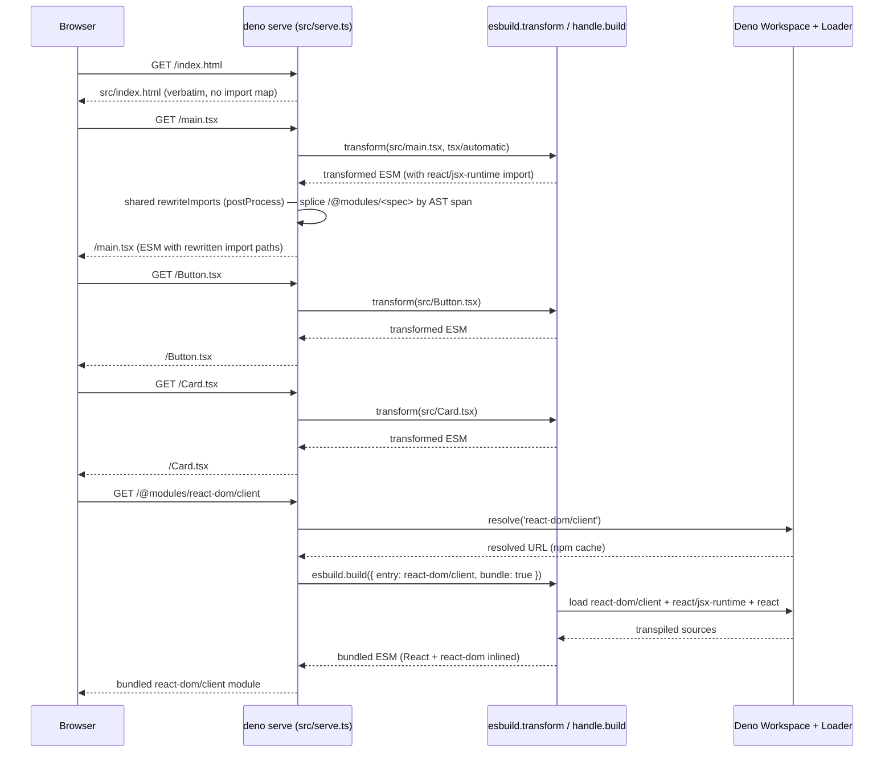

# `@examples/component-library`

A minimal React component library that demonstrates authoring Deno source and bundling it with
[`@ggpwnkthx/esbuild`](https://jsr.io/@ggpwnkthx/esbuild) +
[`@ggpwnkthx/esbuild-plugin-deno`](https://jsr.io/@ggpwnkthx/esbuild-plugin-deno).

## What this shows

- Source code uses the `deno.json` import map for `react`, `react-dom`, and `react/jsx-runtime`.
- `src/serve.ts` is a `deno serve` dev server that serves every local `.ts` / `.tsx` file as its own
  ESM module (one browser request per file) and bundles npm dependencies on demand:
  - Each `*.tsx` / `*.ts` request is run through `esbuild.transform` with the `tsx` / `automatic`
    JSX loader. The transformed source is then run through the shared `rewriteImports` rewriter from
    `@ggpwnkthx/esbuild-wrapper-shared` (called from `src/server/serve_transform.ts`'s `postProcess`
    hook), which uses `@deno/graph`'s `parseModule` to locate the AST spans of allowlisted
    bare-specifier imports (`react`, `react-dom`, `react-dom/client`, `react/jsx-runtime`,
    `react/jsx-dev-runtime`) and splices them back as `/@modules/<spec>` URLs by character offset.
    No browser-side import map is required, and `RewriteOptions.failAsErrorBody: true` surfaces
    non-allowlisted imports inline as executable `throw new Error(...)` module bodies.
  - The `/@modules/<spec>` route delegates to `createDenoPlugin().handle.build(spec)` via
    `src/server/serve_module.ts`, which produces a fully bundled, self-contained module for that
    spec only (React + react-dom each become one bundle per page load). An explicit allowlist
    (`src/server/allowlist.ts`) keeps `/@modules/*` from being a public CDN.
  - The browser fetches `main.tsx`, the local components it imports, and the npm modules it needs;
    the npm cache layer still travels through the server bundler but the browser only fetches one
    module per allowed spec.
  - Non-allowlisted bare specifiers (e.g. `import _ from "lodash"`) throw at the server and surface
    as a loud `throw new Error(...)` body in the browser instead of failing silently in module
    resolution.
- `tests/browser_test.ts` boots the server, then loads the page in headless Chromium via
  `@astral/astral` and verifies the rendered component tree, script errors, click behavior, and that
  the browser fetches the expected module set (`/main.tsx`, `/Button.tsx`, `/Card.tsx`,
  `/@modules/react-dom/client`).

## Layout

```text
examples/component-library/
├── README.md
├── deno.json
├── src/
│   ├── Button.tsx        # published component
│   ├── Card.tsx          # published component
│   ├── index.html        # demo page; loads /main.tsx as a module
│   ├── main.tsx          # demo entry (consumes the library)
│   ├── serve.ts          # runtime dev server: routes via router + helpers
│   └── server/           # dev-server modules (excluded from publish)
│       ├── allowlist.ts
│       ├── paths.ts
│       ├── plugin.ts
│       ├── serve_module.ts
│       ├── serve_static.ts
│       └── serve_transform.ts
└── tests/
    ├── allowlist_test.ts
    ├── browser_test.ts
    ├── router_test.ts
    ├── selectors.ts
    └── serve_transform_test.ts
```

`src/index.html`, `src/main.tsx`, `src/serve.ts`, `src/server/`, and `tests/` are excluded from
publishing via `deno.json`'s `publish.exclude`. The published tarball contains only the two
components.

## Running

```sh
# boot the dev server on http://localhost:8000 (override with --port=N)
deno task serve

# run the browser end-to-end test (boots the server, then asserts)
deno task test

# format, lint, check, and test
deno task ci
```

The browser test requires a Chromium binary. Set `CHROME_PATH` if it is not on a default search
path:

```sh
CHROME_PATH=/usr/bin/chromium deno task test
```

## How the server works

`src/serve.ts` boots `loadPlugin()` once at module load, which constructs a single Deno
`Workspace` + `Loader` and an esbuild plugin that share the same resolver (`src/server/plugin.ts`).
The plugin handle is reused across every request, and is released on `unload` via
`addEventListener('unload', () => handle[Symbol.dispose]())`.

The server wires four routes through the shared `Router` from `@ggpwnkthx/esbuild-wrapper-shared`
(imported in `src/serve.ts`) in declaration order — adding a new route means appending an entry to
the routes array rather than editing an `if` chain:

- `indexRoute()` — `/` and `/index.html` → serves `src/index.html` verbatim via
  `src/server/serve_static.ts`.
- `moduleRoute(handle)` — `/@modules/<spec>` → checks the allowlist (`src/server/allowlist.ts`) and
  delegates to `handle.build(spec)` via `src/server/serve_module.ts`. The response is a
  self-contained ESM module for that spec only.
- `transformRoute()` — `*.tsx` / `*.ts` under `src/` or `tests/` → resolves the URL to the local
  file via `src/server/paths.ts` and runs
  `esbuild.transform({ loader: 'tsx', jsx: 'automatic',
  jsxImportSource: 'react', format: 'esm', target: 'es2022' })`
  through the `transformLocal()` helper in `src/server/serve_transform.ts`. The `postProcess` hook
  in `transformLocal()` runs the transformed body through shared `rewriteImports` so allowlisted
  bare specifiers point at `/@modules/<spec>` URLs. The output is cached per file via the shared
  `Transpiler` and invalidated whenever the source mtime (`TranspileRequest.version`) changes.
- `staticUnderRoute()` — anything else under `src/` → static file response (also via `serveStatic`).
- Else → 404.

### Browser request flow



The browser sees a real ESM graph: each local file is its own request, and React/ReactDOM arrive as
one bundled payload per allowed specifier. The import map is gone — the server inlines the correct
`/@modules/<spec>` URLs into every served module via AST-level rewrites.

## Adding a change

1. Edit any `src/*.tsx` or `src/index.html`.
2. Reload the browser tab (or re-run `deno task test` for the smoke check).

The transform route caches per-file output keyed on the file's mtime. Editing a source file
invalidates its cache automatically.
