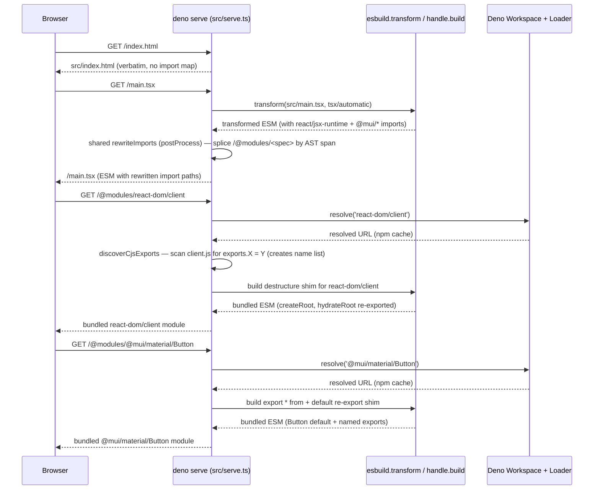

# `@examples/component-library`

A Material UI demo that exercises the same per-file ESM dev server pipeline as
[`@ggpwnkthx/esbuild`](https://jsr.io/@ggpwnkthx/esbuild) +
[`@ggpwnkthx/esbuild-plugin-deno`](https://jsr.io/@ggpwnkthx/esbuild-plugin-deno). `src/main.tsx`
renders MUI's `Button`, `Card`, `CardContent`, and `Typography` directly against React 18, served by
the `deno serve` dev server in `src/serve.ts`. There is no local `Button.tsx`/`Card.tsx` library —
every component in the demo comes from `@mui/material`.

## What this shows

- The `deno.json` `imports` map is the single source of truth for what the browser can fetch. Every
  key whose value is an `npm:` URL is an allowed `/@modules/<spec>` target: `react`,
  `react/jsx-runtime`, `react/jsx-dev-runtime`, `react-dom`, `react-dom/client`,
  `@mui/material/Button`, `@mui/material/Card`, `@mui/material/CardContent`,
  `@mui/material/Typography`, `@emotion/react`, `@emotion/styled`. The subpath imports keep
  esbuild's automatic JSX transform output (`import { jsx } from "react/jsx-runtime"`) rewriteable
  to `/@modules/react/jsx-runtime`. Type packages (`@types/react`, `@types/react-dom`), dev tooling
  (`@astral/astral`, `@deno/graph`, `@ggpwnkthx/esbuild-wrapper-shared`, `@std/*`) share the
  `imports` map but their values are `jsr:` URLs the browser would not import, so they are filtered
  out of the allowlist by `src/serve.ts` at module load to keep `/@modules/<spec>` from being a
  public CDN for the wrong audience.
- `src/serve.ts` is a `deno serve` dev server that serves every local `.ts` / `.tsx` file as its own
  browser-routable ESM module (one request per file) and bundles npm dependencies on demand:
  - Each `*.tsx` / `*.ts` request runs through `esbuild.transform` with the `tsx` / `automatic` JSX
    loader, then through the shared `rewriteImports` rewriter from
    `@ggpwnkthx/esbuild-wrapper-shared` (called from `src/server/serve_transform.ts`'s `postProcess`
    hook). `rewriteImports` uses `@deno/graph`'s `parseModule` to locate the AST spans of
    bare-specifier imports and splice them back as `/@modules/<spec>` URLs by character offset. No
    browser-side import map is required; the rewritten URLs are written into every served module.
  - The `/@modules/<spec>` route delegates to `createDenoPlugin().handle.build(spec)` via
    `src/server/serve_module.ts`, which produces a fully bundled, self-contained ESM module for that
    spec only.
  - Non-allowlisted bare specifiers (e.g. `import _ from "lodash"`) throw at the server and surface
    as a loud `throw new Error(...)` body in the browser instead of failing silently in module
    resolution.
- `tests/browser_test.ts` boots the server, then loads the page in headless Chromium via
  `@astral/astral` and asserts on module loading + AST rewriting.

## Layout

```text
examples/component-library/
├── README.md
├── deno.json
├── src/
│   ├── index.html        # demo page; loads /main.tsx as a module
│   ├── main.tsx          # demo entry; renders MUI's Button + Card
│   ├── serve.ts          # runtime dev server: routes via router + helpers
│   └── server/           # dev-server modules
│       ├── paths.ts
│       ├── plugin.ts
│       ├── serve_module.ts
│       ├── serve_static.ts
│       └── serve_transform.ts
└── tests/
    ├── browser_test.ts
    ├── router_test.ts
    ├── selectors.ts
    └── serve_transform_test.ts
```

`src/main.tsx`, `src/serve.ts`, `src/server/`, and `tests/` are not part of any published artifact —
`deno.json` no longer ships a `publish` block. The example is purely a runtime smoke test of the dev
server pipeline.

## Running

```sh
# boot the dev server on http://localhost:8000 (override with --port=N)
deno task serve

# run the full test suite (router + serve_transform + browser)
deno task test

# format, lint, check, and test
deno task ci
```

The browser test requires a Chromium binary. Set `CHROME_PATH` if it is not on a default search
path:

```sh
CHROME_PATH=/usr/bin/chromium deno task test
```

## How the server works

`src/serve.ts` boots `loadPlugin()` once at module load, which constructs a single Deno
`Workspace` + `Loader` and an esbuild plugin that share the same resolver (`src/server/plugin.ts`).
The plugin handle is reused across every request, and is released on `unload` via
`addEventListener('unload', () => handle[Symbol.dispose]())`.

The server wires four routes through the shared `Router` from `@ggpwnkthx/esbuild-wrapper-shared`
(imported in `src/serve.ts`) in declaration order — adding a new route means appending an entry to
the routes array rather than editing an `if` chain:

- `indexRoute()` — `/` and `/index.html` → serves `src/index.html` verbatim via
  `src/server/serve_static.ts`.
- `moduleRoute(handle)` — `/@modules/<spec>` → checks the allowlist (derived from this example's
  `deno.json` `imports` keys at module load) and delegates to `handle.build(spec)` via
  `src/server/serve_module.ts`. The response is a self-contained ESM module for that spec only.
- `transformRoute()` — `*.tsx` / `*.ts` under `src/` or `tests/` → resolves the URL to the local
  file via `src/server/paths.ts` and runs
  `esbuild.transform({ loader: 'tsx', jsx: 'automatic',
  jsxImportSource: 'react', format: 'esm', target: 'es2022' })`
  through the `transformLocal()` helper in `src/server/serve_transform.ts`. The `postProcess` hook
  in `transformLocal()` runs the transformed body through shared `rewriteImports` so allowlisted
  bare specifiers point at `/@modules/<spec>` URLs (using the same resolver passed in from
  `src/serve.ts`). The output is cached per file via the shared `Transpiler` and invalidated
  whenever the source mtime (`TranspileRequest.version`) changes.
- `staticUnderRoute()` — anything else under `src/` → static file response (also via `serveStatic`).
- Else → 404.

### `/@modules/<spec>` shim

`src/server/serve_module.ts` produces the bundle for each npm spec via a one-line shim fed through
`esbuild.build({ bundle: true, format: 'esm' })`. The shim has two shapes:

```ts
// CJS-only specs (react, react-dom, react-dom/client, react/jsx-runtime,
// react/jsx-dev-runtime): the named exports are discovered by scanning
// the underlying CJS source for `exports.X = Y;` assignments (see
// `discoverCjsExports` in `serve_module.ts`). The walker recurses
// through `if/else` branches and follows `module.exports = require('./cjs/...')`
// wrapper chains, so it picks up everything React's source declares
// statically without needing a hand-maintained list. The destructure
// below is the runtime form esbuild emits.
import * as ns from ${abs};
const { Children, Component, ..., version } = ns;
export { Children, Component, ..., version };
export default ns;

// Everything else (MUI, Emotion, anything that ships a real ESM module):
// forward all named exports plus the default export.
export * from ${abs};
export { default } from ${abs};
```

If the scan encounters a CJS export shape it can't statically resolve (computed keys,
`Object.assign(exports, ...)`, `module.exports = function/class/expr`), it warns the dev-server
console once per unique message and falls through to the `export * from` shim — consumers see
`undefined` for the missed name rather than a hard build failure.

The bundle's other bare specifiers (e.g. `import * as React from "react"` inside MUI) are picked up
by the same shared `rewriteImports` post-pass that runs on the local `*.tsx` / `*.ts` transforms, so
the browser sees one consistent `/@modules/<spec>` URL per import everywhere.

`@deno/graph` AST parsing requires the specifier to end in a JS extension or be normalized to `.js`
(see the comment in `packages/wrappers/shared/rewrite_imports.ts`). The wrapper was bumped to
`^0.3.3` in this example's `deno.json` to pick up that normalization plus the `isBareSpec` regex
update that matches scoped npm specifiers like `@mui/material`.

`react` is then externalised for every non-React bundle via `reactExternalPlugin(spec)` in
`src/server/serve_module.ts`; see
[How React is shared across bundles](#how-react-is-shared-across-bundles) below.

### Browser request flow



The browser sees a real ESM graph: each local file is its own request, and React/ReactDOM and every
MUI subpath arrive as one bundled payload per allowed specifier. The import map is gone — the server
inlines the correct `/@modules/<spec>` URLs into every served module via AST-level rewrites.

## How React is shared across bundles

`@mui/material` and `react-dom` both need to call hooks from the _same_ React module. If each
per-spec bundle inlined its own React copy, the browser would end up with multiple React instances,
each with its own `ReactSharedInternals`. `react-dom` would set the dispatcher on its own copy, and
MUI's `useContext` would read from MUI's copy and see `null`.

The dev server avoids this by externalising `react` for every non-React bundle via
`reactExternalPlugin(spec)` in `src/server/serve_module.ts`. When a non-React bundle (e.g.
`/@modules/@mui/material/Card`) references `react`, esbuild emits
`import * as ReactNNN from "/@modules/react"`. The browser fetches `/@modules/react` once and reuses
the cached module for every dependent bundle, so MUI and `react-dom` get the same React instance and
the same `ReactSharedInternals`.

`react-dom`, `react-dom/client`, `react/jsx-runtime`, and `react/jsx-dev-runtime` are **not** shared
— they're bundled per-route as self-contained modules. (Sharing them with React would create a
cycle: the React bundle's prelude would import `react/jsx-dev-runtime` and vice-versa, and the
browser's ESM module loader would resolve the cycle with a partial-export namespace whose
`__SECRET_INTERNALS...` is still `undefined`.)

The CJS-bridged bundles (`react-dom`, `react-dom/client`, the two `react/jsx-*` modules) also need
the `require("react")` calls inside their CJS-bundled source to resolve to the shared
`/@modules/react` URL. esbuild's CJS-to-ESM bridge leaves those calls as `__require("react")` (the
dynamic-require helper that throws in the browser). `neutralizeDynamicReactRequires(spec)` in
`src/server/serve_module.ts` rewrites each `__require("react")` (and its `__require2/3` siblings) to
a static `__React0` reference and prepends `import * as __React0 from "/@modules/react";` to the
bundle, so the CJS-bridged code reads from the shared module's namespace import instead of trying to
call a non-existent `require`.

## Adding a change

1. Edit `src/main.tsx`, `src/index.html`, or any `src/server/*.ts`.
2. Reload the browser tab (or re-run `deno task test` for the smoke check).

The transform route caches per-file output keyed on the file's mtime. Editing a source file
invalidates its cache automatically.
